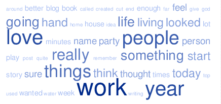

We use HC corpora data collected across English Twitter posts, blogs and news. To get insight into Natural Language Processing and eventually construct a prediction algorithm for the next word during typing (e.g. auto-suggestions on mobile devices).

We will use the following files:

| File              | Lines   | Words    |
|-------------------|---------|----------|
| en_US.blogs.txt   | 899288  | 37334114 |
| en_US.news.txt    | 1010242 | 34365936 |
| en_US.twitter.txt | 2360148 | 30359804 |

The first step is to acquire and load the data. We obtain English Twitter files from Coursera Project webpage and in view of computational restrictions we choose a representative random subset of 10 thousand lines (using Linux sort -R command).

First we load the text using the following R code.

```{r}
#Representative subset of 10000 lines saved in test_file
fileName <- "test_file"
#Create file connection
con <- file(fileName, "r")
#Read all words
d <- scan(con, character(0))
# Close connection
close(con)
```

Next, we want to exclude profanity from the analysis. We created a text file with common English profanity words and load it into our R session.

```{r}
con <- file("bad_words", "r")
bad <- scan(con, character(0))
close(con)
```

For analysis we tokenize the text into words (excluding "bad" words), numbers and punctuation. We store those elements in 3 different vectors.

```{r}
d <- lapply(d, toupper)
bad <- lapply(bad, toupper)
words <- c(); numbers <- c(); puncts <- c()

for (i in (1:300000)){
  element <- d[[i]]
  word <- gsub("[^A-Z]+", "", element)
  good <-1
  if (word %in% bad) {good <-0}
  if ((word > 0)&good){words <- c(words, word)}
  number <- gsub("[^0-9]+", "", element)
  if (number > 0){numbers <- c(numbers, number)}
  pun <- gsub("[^[:punct:]]", "", element)
  if (nchar(pun) > 0){puncts <- c(puncts, pun)}
}
```

<br><br>

<br><br>

An interesting question is: what are the ten most common words in the dataset?
<br>

```{r, results='asis', echo=FALSE}
tab <- table(words)
df <- as.data.frame(tab)
names(df) <- c("word","times")
df$rank <- rank(-df$times, ties.method="min")
df <- df[order(df$rank,decreasing = F),]
library(xtable)
print(xtable(df[(1:10), c("word", "times")]), type="html", include.rownames=FALSE)
```

<br>
These are common English particles. Let us look at the most used "long" words (more than 6 letters):


```{r, results='asis', echo=FALSE}
tab <- table(words[which(nchar(words)>6)])
df <- as.data.frame(tab)
names(df) <- c("word","times")
df$rank <- rank(-df$times, ties.method="min")
df <- df[order(df$rank,decreasing = F),]
library(xtable)
print(xtable(df[(1:10), c("word", "times")]), type="html", include.rownames=FALSE)
```

<br>
To understand how many words constitute the major part of the language, we plot the histogram of the frequencies of words.


```{r, results='asis', echo=FALSE}
tab <- table(words)
df <- as.data.frame(tab)
names(df) <- c("word","times")
hist(df$times/sum(df$times)*100, 10000, freq=F, xlim=c(0,0.05),
     xlab="Word Frequency, %", main="Distribution of word frequencies")
#d <- density(df$times/sum(df$times))
#plot(d, xlim<-c(0,0.01))
```

We observe that most of the words have low (<5%) frequency.

The following graph shows how many distinct words are necessary to cover a part of the text in percentage.

An interresting observation is that we need only 200 words to cover about 50% of any text and 1000 words to cover 80%. We conclude that for English language an average text contains about 20% of rare words. 

```{r, echo=FALSE}
tab <- table(words)
df <- as.data.frame(tab)
names(df) <- c("word","times")
df$rank <- rank(-df$times, ties.method="min")
df <- df[order(df$rank,decreasing = F),]

x <- seq(0, 1000, by=1)
y <- c()
for (i in x){
  res <- round(sum(df$times[0:i])/sum(df$times)*100,1)
  y <- c(y, res)
}

plot(x,y, type="l", col="green", lwd=3, xlab="Number of Unique Words", ylab="Percent of Text Covered")

```


Many words tend to be used together, meaning that it is possible to give a prediction with high probability of the following word. For instance, let us look at the most common occurring word pairs.

```{r, results='asis', echo=FALSE}
pairs <- c()
for (i in 1:(length(words)-1)){
  npair <- paste(words[i], words[i+1])
  pairs <- c(pairs, npair)
}
  tab <- table(pairs)
  df <- as.data.frame(tab)
  names(df) <- c("Words pair","Times")
  df$rank <- rank(-df$Times, ties.method="min")
  df <- df[order(df$rank,decreasing = F),]
  library(xtable)
  print(xtable(df[(1:50), c("Words pair", "Times")]), type="html",
        include.rownames=FALSE)
```

<br>
We can also explore collocations of longer words (>3 characters).

```{r, results='asis', echo=FALSE}
pairs <- c()
lwords <- words[which(nchar(words)>3)]
for (i in 1:(length(lwords)-1)){
  npair <- paste(lwords[i], lwords[i+1])
  pairs <- c(pairs, npair)
}
  tab <- table(pairs)
  df <- as.data.frame(tab)
  names(df) <- c("Words pair","Times")
  df$rank <- rank(-df$Times, ties.method="min")
  df <- df[order(df$rank,decreasing = F),]
  library(xtable)
  print(xtable(df[(1:50), c("Words pair", "Times")]), type="html",
        include.rownames=FALSE)
```

<br><br>

In the following publication we provide prediction algorithm for the next word during typesetting.
